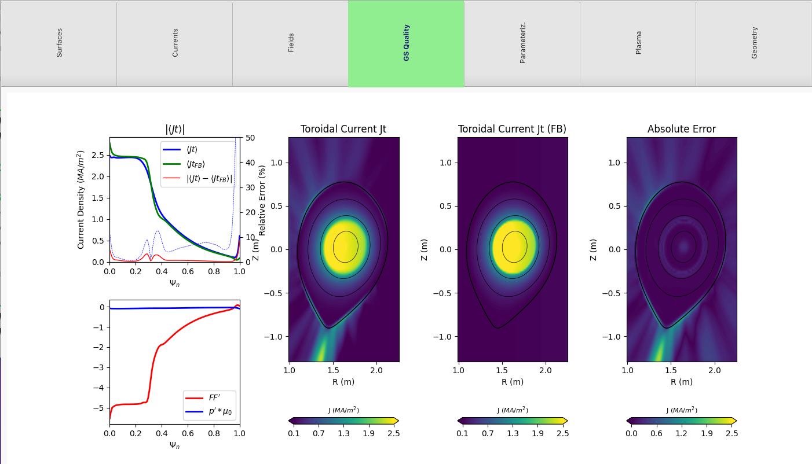

Equilibria Capabilities
=======================

**PORTALS** has a quick g-eqdsk file reader and visualizer that is heavily based on OMFITclasses

To open and plot a g-eqdsk file:

.. code-block:: python

	from portals.gs_tools import GEQmodule
	g = GEQmodule.PORTALSgeqdsk(file)
	g.plot()

It will plot results in a notebook-like plot with different tabs:

