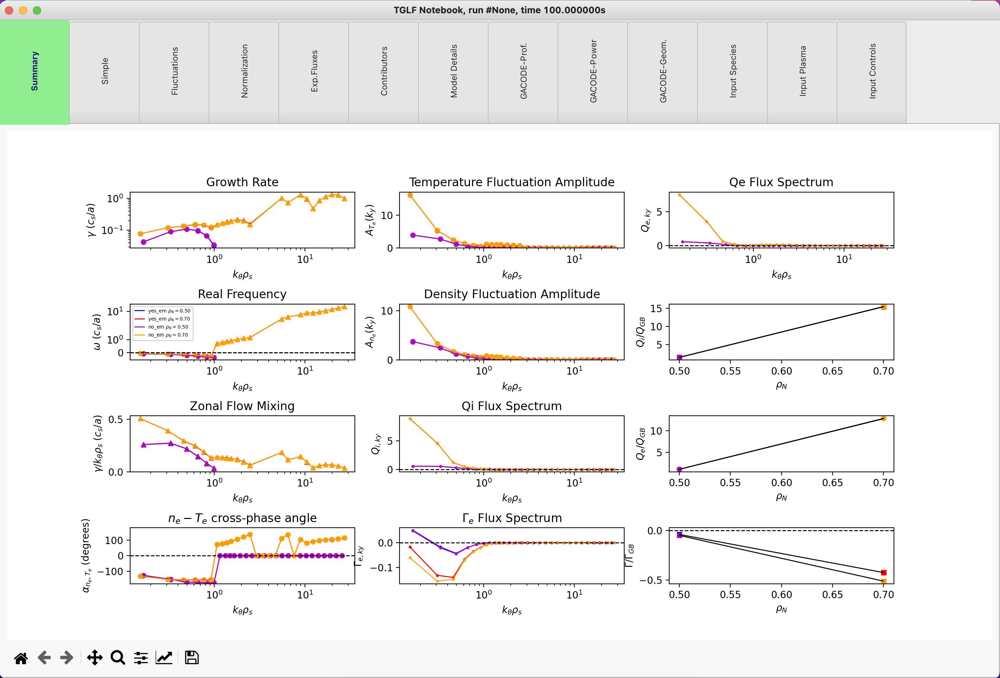

TGLF Capabilities
=================

Before you go through these instructions for specific applications of PORTALS, make sure you have followed the instructions in [README](./README.md). You can run a regression test:
```
python3 $PORTALS_PATH/regressions/TGLF_workflow.py
```
This basic regression test will perform an entire TGLF workflow, from a `.CDF` TRANSP output file to a plot with TGLF outputs. It will eventually plot results in a notebook-like plot with different tabs with information about TGLF outputs and inputs, similar to this:



Run TGLF from TRANSP results
----------------------------

There are a number of routines out there that utilize TRANSP outputs to build input files to other simulation codes. PORTALS can be used to facilitate this process to run codes from the GACODE suite.

First, one should create a TGLF class that contains information for the extraction of TRANSP data. The `.CDF` file is needed at this step. It is recommended that a namelist file `TR.DAT` file exists in the same folder, to grab direction of currents and fields. If no namelist is found in the same folder, default signs will be used.
```
from portals.gacode_tools import TGLFmodule

LocationCDF = '/path/to/file.CDF' # Absolute path of the CDF file
timeRun     = 2.0                 # Time of of interest in seconds
avTime      = 0.02                # Averaging window around timeRun (+-avTime)
rho         = 0.9                 # rho location (norm. sqrt. tor. flux) to run TGLF

tglf = TGLFmodule.TGLF( cdf = LocationCDF, time = timeRun, avTime = avTime, rhos = [rho] )
```

Next one needs to indicate the folder in which to perform all operations required to generate the input files to TGLF.
```
folderWork = '/path/to/final/folder' # Folder for operations and storage
cdf = tglf.prep( folderWork )
```

This routine will generate in `folderWork` all the final (`input.tglf`) and intermediate (`input.gacode`, `plasmastate.cdf`, `.geq`) files.

One can stop here and run TGLF externally as one wishes, independent from PORTALS. But you can also run TGLF through PORTALS if the SSH connections to ENGAGING are set properly:
```
tglf.run( subFolderTGLF = 'run1/' )
```

This workflow will generate all TGLF outputs in the folder `/path/to/final/folder/run1/`. Now one can read the results generated and store them in the `tglf.results` dictionary with a self-descriptive short label:
```
tglf.read( label = 'base_case' )
```

One can also run a new TGLF simulation with different settings (e.g. with perpendicular magnetic fluctuations) and store the results with a different label:
```
tglf.run( subFolderTGLF = 'run2/', extraOptions = {'USER_BPER':True} )
tglf.read( label = 'electromagnetic' )
```

Now one can plot all TGLF results together with:
```
tglf.plotRun( labels = [ 'base_case', 'electromagnetic' ] )
```

Run TGLF scans from TRANSP results
----------------------------------

Check out [this script](../../dev_tests/TGLF_case3.py) and modify it for your specific case.

IMPORTANT NOTES
---------------

- The `.prep()` method performs three operations in a sequence:
1. `TRXPL` (https://w3.pppl.gov/~hammett/work/GS2/docs/trxpl.txt) to generate `plasmastate.cdf` and `.geq` files for a specific time-slice from the TRANSP outputs.
2. `PROFILES_GEN` to generate an `input.gacode` file from the `plasmastate.cdf` and `.geq` files. This file is standard within the GACODE suite and contains all plasma information that is required to run core transport codes.
3. `TGYRO` for a "zero" iteration to generate `input.tglf` at specific `rho` locations from the `input.gacode`. This method to generate input files is inspired by how the OMFIT framework works (https://gafusion.github.io/OMFIT-source/index.html).

- `.prep()` will only perform the operations that it needs. For example, if `input.gacode` is found in the right location, it will avoid running steps #1 and #2. This is the default behavior unless a `restart = True` argument is passed to `.prep()`. The user must be careful not to manually change the files in the working folder, to avoid losing track of the files that were used in the process.

- In a similar fashion, `.run()`  will NOT run TGLF if PORTALS detects that ALL the TGLF output files exist in the right location, unless a `restart=True` argument is passed to `.run()`. The user must pass the restart argument if the TGLF settings are changed and the same folder contains outputs already.

- One can change every TGLF input with the `extraOptions = {}` dictionary, as shown earlier. However, `gacode_tools.GACODEdefaults.py` contains a list of presets for TGLF that can be selected by simply passing the argument `TGLFsettings = 1` to the `.run()` method.
Available preset as of 09/08/2021 are:
	- TGFLsettings = 0: Minimal working example
	- TGLFsettings = 1: "Old" ES SAT1
	- TGLFsettings = 2: ES SAT0
	- TGLFsettings = 3: ES SAT1 (a.k.a. SAT1geo)
	- TGLFsettings = 4: ES SAT2

The user is not limited to use those combinations. One can start with a given `TGLFsettings` option, and then modify as many parameters as needed with the `extraOptions` dictionary.

## Interpreting external TGLF results

When TGLF has been run in a folder `tglf/` outside of the PORTALS framework, one can also use PORTALS to look at the ouput results as follows:
```
from portals.gacode_tools.TGLFmodule import TGLF

tglf_results = TGLF()

folderTGLFresults = 'tglf/'
input_gacodeLoc   = '/path/to/file.gacode'
rho_of_interest   = 0.65

tglf_results.read( folder = folderTGLFresults, input_profilesLoc = input_gacodeLoc, NoSuffixesRho = rho_of_interest )
```
Note that one needs to provide the `input.gacode` file that was used to generate the TGLF input file, as well as the `rho` location. This is because the TGLF files by themselves do not contain information about the normalization, thus one needs more information to build useful output quantities like heat fluxes in real units.

Now, one can plot all TGLF results:
```
tglf_results.plotRun()
```