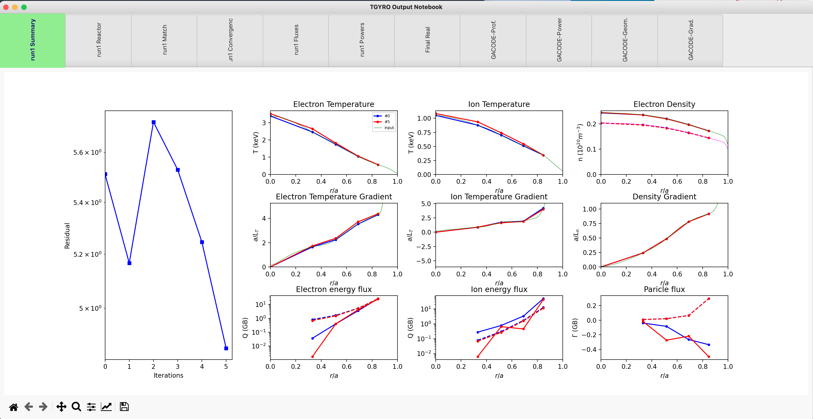

TGYRO
==================

**PORTALS** can be used to run the TGYRO transport solver, interpret results and plot revelant quantities.
This framework does not provide linceses or support to run TGYRO, therefore, please see :ref:`Installation` for information on how to get TGYRO working and how to configure your setup.

Once setup has been successful, the following regression test should run smoothly:

.. code-block:: console

	python3 $PORTALS_PATH/regressions/TGYRO_workflow.py

Run TGYRO from an input.gacode file
-----------------------------------

For this tutorial we will need the following modules:

.. code-block:: python

	from portals.gacode_tools import TGYROmodule,PROFILESmodule
	from portals.misc_tools   import IOtools

Select the location of the input.gacode file to start the simulation from. Note that you can use the `IOtools.expandPath()` method to work with relative paths. You should also select the folder where the simulation will be run:

.. code-block:: python

	gacode_file = IOtools.expandPath( '$PORTALS_PATH/regressions/data/input.gacode'  )
	folder   	= IOtools.expandPath( '$PORTALS_PATH/regressions/scratch/tgyro_tut/' )

Create a PROFILES class from the input.gacode file:

.. code-block:: python

	profiles = PROFILESmodule.PROFILES_GACODE( gacode_file )

.. note::

	Note that the profiles class can be plotted, for convenience.

	.. code-block:: python

		profiles.plot()

	.. figure:: figs/PROFILESnotebook.png
	:align: center
	:alt: TGLF_Notebook
	:figclass: align-center

Now the TGYRO class can be created:

.. code-block:: python

	tgyro = TGYROmodule.TGYRO()
	tgyro.prep( folder, profilesclass_custom = profiles )

Now it is time to set the TGYRO settings, such as the radial range (vectorRange[0] to vectorRange[1]), number of points to simulate (vectorRange[2]), the solver parameters, physics and TGLF options:

.. code-block:: python

	vectorRange 	= [0.3,0.8,4]
	solver 			= { 'step_jac':  1E-2, 'step_max':1E-2,'res_method': 2, 'tgyro_method': 6, 'relax_param': 0.1 } 
	physics_options = { 'TargetType':2 }
	PredictionSet   = [1,1,0] # Te, Ti, ne

	iterations 		= 5
	TGLFsettings    = 5

Now TGYRO can be run:

.. code-block:: python

	tgyro.run( subFolderTGYRO       = 'run1/',     iterations            = iterations,
			   vectorRange          = vectorRange, PredictionSet         = PredictionSet,
			   TGLFsettings         = TGLFsettings,
			   TGYRO_solver_options = solver,      TGYRO_physics_options = physics_options)

And read:

.. code-block:: python

	tgyro.read( label = 'run1' )

And plot:

	tgyro.plotRun( labels = [ 'run1' ] )

As a result, a TGYRO notebook with different tabs will be opened with all relevant output quantities:

Read TGYRO results that were run externally
----------------------------------------------

Create a profiles class with the `input.gacode` file that TGYRO used to run and the folder with all output files:

.. code-block:: python

	from portals.gacode_tools import TGYROmodule,PROFILESmodule
	from portals.misc_tools   import IOtools

	gacode_file = IOtools.expandPath( '$PORTALS_PATH/regressions/data/input.gacode'  )
	folder   	= IOtools.expandPath( '$PORTALS_PATH/regressions/scratch/tgyro_tut/run1/' )

	profiles    = PROFILESmodule.PROFILES_GACODE( gacode_file )
	tgyro_out   = TGYROmodule.TGYROoutput( folder, profiles = profiles )

Plot results:

.. code-block:: python

	tgyro_out.plot()
