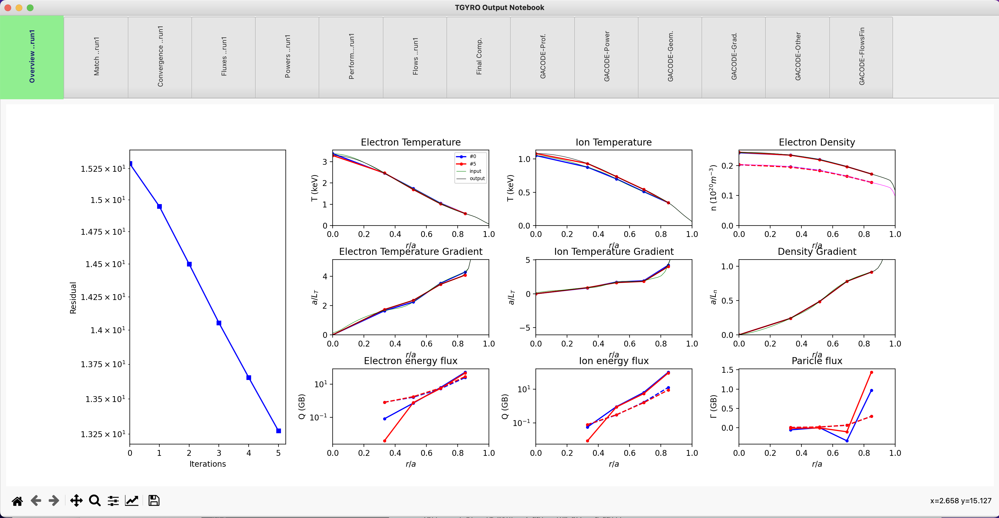

TGYRO Capabilities
==================

Before you go through these instructions for specific applications of PORTALS, make sure you have followed the instructions in [README](./README.md). You can run a regression test:

.. code-block:: console

	python3 $PORTALS_PATH/regressions/TGYRO_workflow.py

This basic regression test will perform an entire TGYRO workflow, starting from a basic `input.gacode` file. It will eventually plot results in a notebook-like plot with different tabs with information about TGYRO outputs and inputs, similar to this:

Run TGYRO from an input.gacode file
-----------------------------------

(coming soon, see `$PORTALS_PATH/regressions/TGYRO_workflow.py` in the meantime)

Read TGYRO results that were run externally
----------------------------------------------

Create a profiles class with the `input.gacode` file that TGYRO used to run:

.. code-block:: python

	from portals.misc_tools		import IOtools
	from portals.gacode_tools 	import TGYROmodule,PROFILESmodule

	file_input_profiles = '/path/to/input.gacode'
	prof                = PROFILESmodule.PROFILES_GACODE(file_input_profiles)

Create a TGYRO output class indicating the folder that contains all TGYRO output files:

.. code-block:: python

	from portals.misc_tools		import IOtools
	from portals.gacode_tools 	import TGYROmodule,PROFILESmodule

	tgyro_folder = '/path/to/tgyro/folder/'
	tgyro_out    = TGYROmodule.TGYROoutput(tgyro_folder,profiles=prof)

Plot results:

.. code-block:: python

	tgyro_out.plot()

