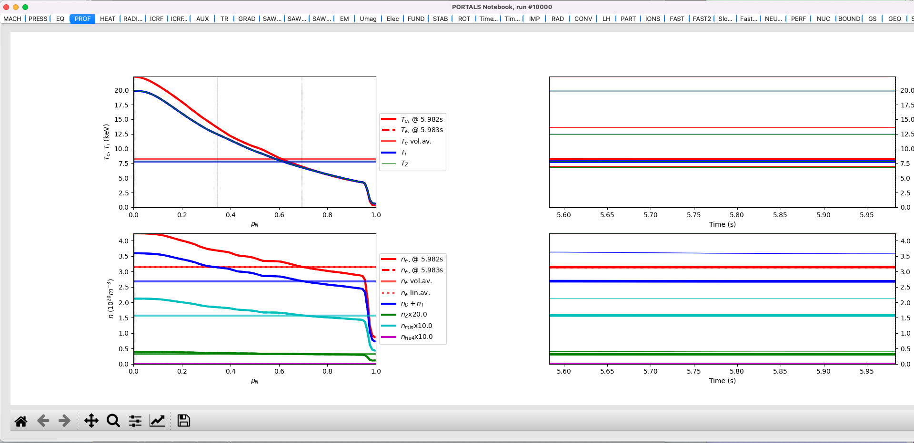

TRANSP Capabilities
===================

Before you go through these instructions for specific applications of PORTALS, make sure you have followed the instructions in [README](./README.md). You can run a regression test:

.. code-block:: console

	python3 $PORTALS_PATH/regressions/TRANSP_workflow.py

This basic regression test will launch a TRANSP run and get results back for plotting. It it fails, it may be because the globus and TRANSP settings are nor properly indicated in the config file. It will eventually plot results in a notebook-like plot with different tabs with information about TRANSP outputs and inputs, similar to this:

Run TRANSP
----------

(beta)

TRANSP runs are very personal and specific to each tokamak and plasma, as diagnostic availability strongly varies and namelist settings are not standarized.
For this reason, this workflow assumes that a folder exists with all the UFILES and namelist required to run TRANSP:

.. code-block:: python

	folder  = /path/to/transpInputs

First, one would initialize the TRANSP class with the given folder and the tokamak:

.. code-block:: python

	from portals.transp_tools import TRANSPtools

	tokamak = 'CMOD'
	t       = TRANSP(folder,tokamak)

Define your run names and MPI settings:

.. code-block:: python

	baseName    = '88664'
	runid       = '88664Z12'
	mpisettings = {'trmpi':1,'toricmpi':64,'ptrmpi':1}

	t.defineRunParameters(runid,baseName,mpisettings=mpisettings)

Run TRANSP:

.. code-block:: python

	t.run()

Check each 10 minutes until it finishes and grab the CDF file:

.. code-block:: python

	t.checkUntilFinished(checkMin=10)

Interpreting TRANSP results
---------------------------

When TRANSP has been run without the MDS+ option (default in PORTALS), a netCDF4 file is generated (`/path/to/file.CDF`). This file can be easily read by the PORTALS framework:

.. code-block:: python

	from portals.transp_tools.CDFtools import CDFreactor

	transp_results = CDFreactor( '/path/to/file.CDF' )

The transp_results is a class that parses important TRANSP outputs.
Example: To plot the electron temperature (in keV) as a function of the square root of the normalized toroidal flux coordinate at the top of the last simulated sawtooth (or last simulated time if no sawtooth present):

.. code-block:: python

	import matplotlib.pyplot as plt
	plt.ion(); fig, ax = plt.subplots()

	index_sawtooth = transp_results.ind_saw
	rho   = transp_results.x[index_sawtooth,:]
	TeKeV = transp_results.Te[index_sawtooth,:]

	ax.plot(rho,TeKeV)

To plot all important time and spatial variables (at time `t1` seconds), simply do:

.. code-block:: python

	transp_results.plotRun( time = t1 )

This command should have created a notebook-like plot with different tabs with information about TRANSP outputs, similar to the result of regression test above.

Detailed information
--------------------

- The contents of the TRANSP class `CDFreactor` can be found in `transp_tools.CDFtools.py` if one wants to understand what post-processing is applied to TRANSP outputs and the units of the variables.
