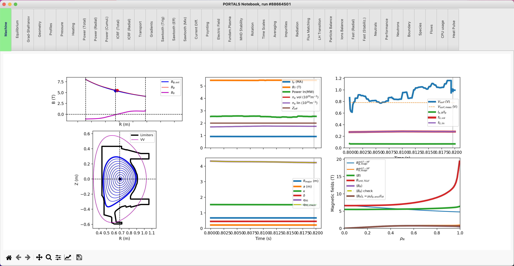

TRANSP
===================

**PORTALS** can be used to run TRANSP, interpret results and plot revelant quantities.
This framework does not provide linceses or support to run TRANSP, therefore, please see :ref:`Installation` for information on how to get TGLF working and how to configure your setup.

Once setup has been successful, the following regression test should run smoothly:

.. code-block:: console

	python3 $PORTALS_PATH/regressions/TRANSP_workflow.py

Run TRANSP
----------

For this tutorial we will need the following modules:

.. code-block:: python

	from portals.transp_tools import TRANSPtools
	from portals.misc_tools   import IOtools

TRANSP runs are very personal and specific to each tokamak and plasma, as diagnostic availability strongly varies and namelist settings are not standarized.
For this reason, this workflow assumes that a folder exists with all the plasma information (UFILES) and namelist required to run TRANSP:

.. code-block:: python

	folder = IOtools.expandPath('$PORTALS_PATH/regressions/data/FolderTRANSP/')

First, one would initialize the TRANSP class with the given folder and the tokamak name:

.. code-block:: python

	tokamak = 'CMOD'
	transp  = TRANSP(folder,tokamak)

Then, select a shotnumber and run name, such that the TRANSP simulation will have the complete name `shotnumber+runname`, and the MPI settings for the TRANSP run:

.. code-block:: python

	shotnumber  = '88664'
	runname     = 'A12'
	mpisettings = { 'trmpi': 1, 'toricmpi': 64, 'ptrmpi': 1 }

	transp.defineRunParameters( shotnumber+runname, shotnumber, mpisettings = mpisettings )

Submit the TRANSP run:

.. code-block:: python

	transp.run()

Check every 10min if the run has finished, and grab final results when they are ready:

.. code-block:: python

	transp.checkUntilFinished( label = runname, checkMin = 10 )

Once the run has finished, results can be plotted:

.. code-block:: python

	t.plot( label = runname ) 

As a result, a TRANSP notebook with different tabs will be opened with all relevant output quantities:

Read results that already exist
-------------------------------

If TRANSP has already been run and the .CDF results file already exists (cdf_file), the workflow in the previous section is not needed and one can simply read and plot the results:

.. code-block:: python

	from portals.transp_tools import CDFtools

	transp_results = CDFtools.CDFreactor( cdf_file )

	transp_results.plotRun()

`transp_results` is a class that parses important TRANSP outputs.
Example: To plot the electron temperature (in keV) as a function of the square root of the normalized toroidal flux coordinate at the top of the last simulated sawtooth (or last simulated time if no sawtooth present):

.. code-block:: python

	import matplotlib.pyplot as plt

	plt.ion(); fig, ax = plt.subplots()

	index_sawtooth = transp_results.ind_saw
	rho            = transp_results.x[index_sawtooth,:]
	TeKeV          = transp_results.Te[index_sawtooth,:]

	ax.plot(rho,TeKeV)

To plot all important time and spatial variables (at time `t1` seconds), simply do:

.. code-block:: python

	transp_results.plotRun( time = t1 )

.. note::

	The contents of the TRANSP class `CDFreactor` can be found in `transp_tools.CDFtools.py` if one wants to understand what post-processing is applied to TRANSP outputs and the units of the variables.

